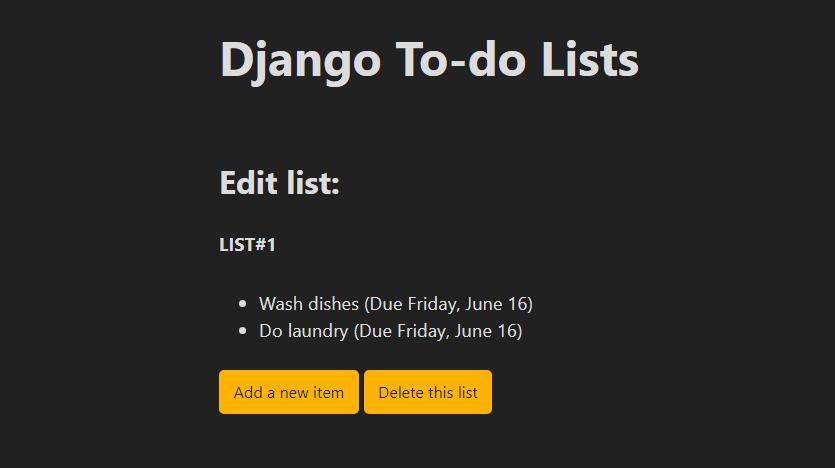
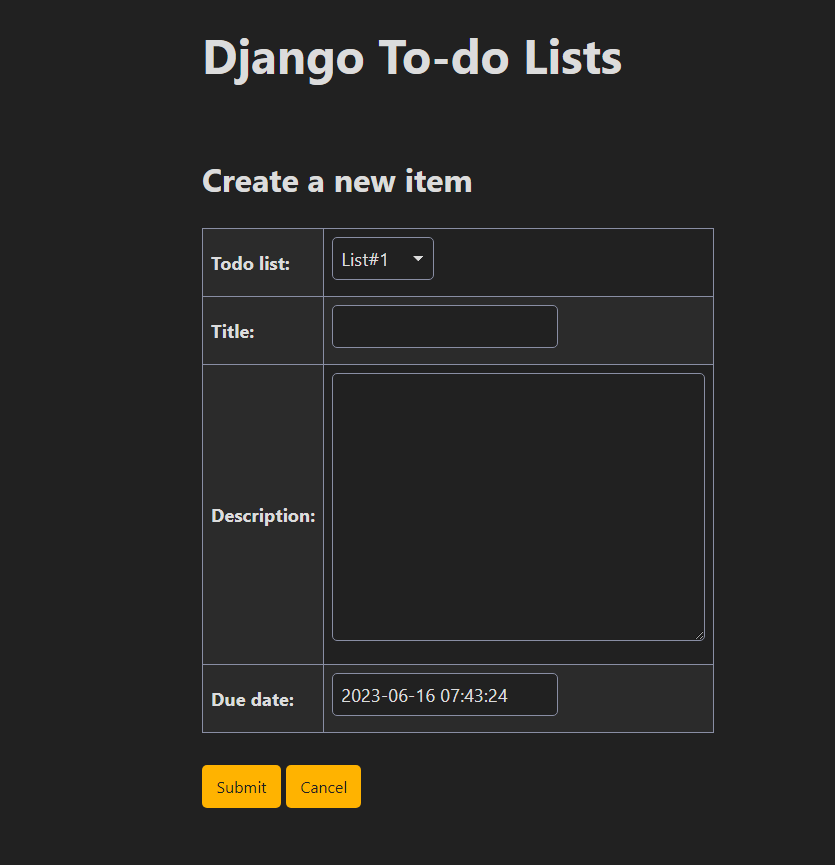
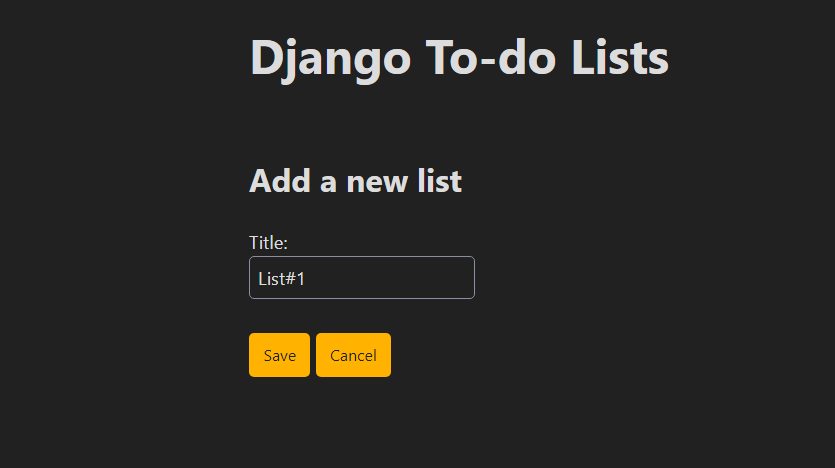

## Project Overview
TodoApp is a simple web application built with Django that allows you to manage your tasks and to-do lists.
## Features
- Create, update, and delete tasks
- Mark tasks as completed
- Filter tasks by status and due date
- Search for specific tasks
- Responsive design for mobile and desktop

## Prerequisites
Before running the polls website, make sure you have the following installed:

* Python (version 3.6 or later)
* Django (version 3.0 or later)

## Installation
1. Clone the repository or download the source code.
```bash
git clone https://github.com/silentwraith03/VoteNexus.git
```
2. Navigate to the project directory.
```bash
cd VoteNexus
```
3. Create the database and apply the migrations.
```bash
python manage.py migrate

```
4. Start the development server.
```bash
python manage.py runserver
```
5. Open your web browser and visit http://localhost:8000/ to access the polls website.

## Project Structure
```arduino
django-todo-list/
  |- images/
  |- todo_app/
  |- todo_project/
  |- db.sqlite3/
  |- manage.py/
  |- LICENSE/
  |- README.md/
  |- requirement.txt/
```

## Screenshots




## Tech Used
* Django
* Django REST Framework
* HTML
* CSS
* JavaScript

## License
[MIT](LICENSE)
## Setup Instructions

1. Navigate into the project directory.
2. Create a virtual environment in a `venv/` folder by typing `python -m venv venv` in your console.
3. Activate the venv using `source venv/bin/activate` (Linux, MacOS) or `venv\Scripts\activate.bat` (Windows).
4. Install the dependencies with `python -m pip install -r requirements.txt`
5. Generate the empty SQLite database and tables using `python manage.py migrate`
5. Run the app with `python manage.py runserver`
6. Browse to the [app home page](http://localhost:8000/) to see the list of todo lists, which will initially be empty. 

You can now start using the UI to add your to-do lists and to-do items to the database. The data will be stored in a new `db.sqlite3` file in the root of your project directory.

You can also use Django's auto-generated [admin interface](http://localhost:8000/admin/) to view, add, and edit the data.
